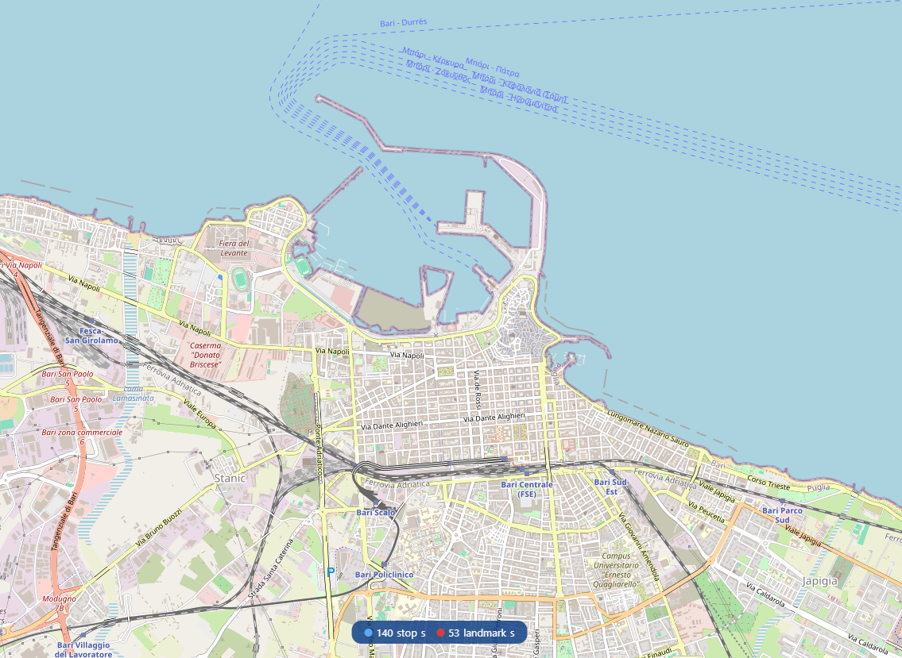

## Overview

This half-day tutorial introduces participants to the practical challenges of achieving data interoperability across heterogeneous sources and to the advantages of an approach based on knowledge graphs [[1](https://arxiv.org/pdf/2011.06423)]. Considering a practical scenario in the mobility domain (the integration of public transport data with open knowledge from Wikidata), participants will learn how knowledge graphs can support data harmonisation and fusion.

The session combines a conceptual introduction with a guided hands-on exercise using **Chimera** [[2](https://ceur-ws.org/Vol-3471/paper9.pdf)], an [open-source framework](https://github.com/cefriel/chimera) for building declarative and composable semantic data transformation pipelines. Participants will design and execute a complete data integration pipeline — from ingestion of structured data to RDF lifting, SPARQL-based enrichment and construction, and RDF lowering — using only YAML route definitions and declarative mapping templates [[3](https://ceur-ws.org/Vol-3718/paper3.pdf)]. No programming experience is required.

---

## Learning Outcomes

By the end of this tutorial, participants will be able to:

- Explain the **any-to-RDF-to-any** integration pattern and its role in enabling semantic interoperability
- Write **lifting and lowering templates** using the [Mapping Template Language (MTL)](https://github.com/cefriel/mapping-template/wiki/Mapping-Template-Language-(MTL)) to convert between arbitrary formats and RDF
- Apply **semantic transformations** within a pipeline to build and reshape knowledge graphs by using **[Apache Camel](https://camel.apache.org/) routes** augmented with [Chimera](https://github.com/cefriel/chimera) components
- Integrate external **data sources** as enrichment sources in a pipeline
- **Deploy and run** a complete end-to-end semantic data integration pipeline feeding data to an actual application

---

## Running Example

To illustrate the pipeline stages, participants will work with a scenario involving the integration of public transport stop data (in [**GTFS**](https://gtfs.org/) format) with geographic and descriptive information retrieved from [**Wikidata**](https://www.wikidata.org/wiki/Wikidata:Main_Page). The resulting knowledge graph is visualised on an interactive online map that updates as data flows through the pipelines built by the participants.

*An interactive dashboard fed by the Chimera pipeline that will be built during the hands-on session.*

This scenario is representative of a broad class of integration problems encountered in domains such as smart cities, industry 4.0, and health data management, where heterogeneous sources can be unified under a common semantic model [[4](https://arxiv.org/pdf/2407.10539),[5](https://arxiv.org/pdf/2508.02708)].

---

**Tutorial schedule and room details will be available as soon as the programme is finalised.**

---

## Pipeline Stages Covered

Participants will configure and run each of the following stages during the hands-on session:

| Stage | Description |
|-------|-------------|
| **Ingest** | Read structured data files (CSV within ZIP archives) re-using the wide library of [Apache Camel](https://camel.apache.org/) components within [Chimera](https://github.com/cefriel/chimera) pipelines |
| **Lift** | Convert tabular records to RDF triples using [MTL](https://github.com/cefriel/mapping-template/wiki/Mapping-Template-Language-(MTL)) lifting templates |
| **Enrich** | Query a remote SPARQL endpoint (Wikidata) to retrieve additional structured information |
| **Construct** | Shape the knowledge graph using SPARQL `CONSTRUCT` queries |
| **Lower** | Serialise RDF back to a target format (CSV) using [MTL](https://github.com/cefriel/mapping-template/wiki/Mapping-Template-Language-(MTL)) lowering templates |
| **Visualise** | Observe pipeline output in a live interactive map interface |

---

## Prerequisites

Participants are expected to have:

- A laptop with [**Docker** installed](https://docs.docker.com/engine/install/) (recommended, in this case no local JDK installation is required) or, alternatively, [**JBang** installed](https://www.jbang.dev/documentation/jbang/latest/installation.html). See [tutorial repository](https://github.com/cefriel/kg4di) for further instructions.
- Repository https://github.com/cefriel/kg4di cloned or downloaded locally.
- Basic familiarity with structured data formats (CSV, JSON)
- Basic knowledge of **RDF** and the Semantic Web stack (recommended)

---

## Tutorial Materials

Slides and all required materials are available in the repository:

- **Slides:** [Download slides](./assets/slides.pdf)
- **Docker image & setup instructions:** [Instructions available here](https://github.com/cefriel/kg4di#prerequisites.) The setup can be tested by trying to run this [test exercise](https://github.com/cefriel/kg4di#hello-world)
- **Chimera repository:** <https://github.com/cefriel/chimera>

---

## Presenters

  
  

    <h3>Marco Grassi</h3>
    
<b>Instructor</b> <em>Knowledge Technologies Researcher, Cefriel</em>

    
Marco Grassi's research focuses on semantic technologies and data interoperability. He is the lead developer of the Chimera framework and the principal author of its tutorial materials.

  

  
  

    <h3>Mario Scrocca</h3>
    
<b>Instructor</b> <em>Senior Knowledge Technologies Researcher, Cefriel</em>

    
Mario Scrocca's research interests include knowledge representation, data management, and semantic interoperability, with applications in mobility and industrial domains. He is a maintainer of the Chimera framework and has co-organised tutorials and courses on Knowledge Graph Construction topics.

  

  
  

    <h3>Alessio Carenini</h3>
    
<b>Organizer</b> <em>Senior Researcher and Software Architect, Cefriel</em>

    
Alessio Carenini has over 18 years of experience in European research projects, with a focus on the application of Semantic Web technologies to knowledge management in data-sharing ecosystems, including metadata modelling and data spaces.

  

  
  

    <h3>Irene Celino</h3>
    
<b>Organizer</b> <em>Research Line Manager, Cefriel</em>

    
Irene Celino coordinates research activities at Cefriel. Her interests span knowledge graphs, semantic interoperability, human-in-the-loop AI, and the human-centric evaluation of AI systems, with over 20 years of experience in cooperative research projects.

  

---

## Previous Editions

  
For information about past editions of this tutorial, including details on previous venues and editions, see <a href="./previous-editions"><strong>Previous Editions</strong></a>.

---

## References

[1] **Scrocca, M., Comerio, M., Carenini, A., Celino, I.**
[Turning transport data to comply with EU standards while enabling a multimodal transport knowledge graph](https://arxiv.org/pdf/2011.06423).
In: *Proceedings of the 19th International Semantic Web Conference (ISWC 2020)*.
Lecture Notes in Computer Science, vol. 12507, pp. 411–429. Springer (2020).
[DOI](https://doi.org/10.1007/978-3-030-62466-8_26), [arXiv](https://arxiv.org/pdf/2011.06423)

[2] **Grassi, M., Scrocca, M., Carenini, A., Comerio, M., Celino, I.**
[Composable semantic data transformation pipelines with Chimera](https://ceur-ws.org/Vol-3471/paper9.pdf).
In: *Proceedings of the 4th International Workshop on Knowledge Graph Construction*, co-located with ESWC 2023.
CEUR Workshop Proceedings, vol. 3471. CEUR (May 2023).
[CEUR](https://ceur-ws.org/Vol-3471/paper9.pdf)

[3] **Scrocca, M., Carenini, A., Grassi, M., Comerio, M., Celino, I.**
[Not everybody speaks RDF: Knowledge conversion between different data representations](https://ceur-ws.org/Vol-3718/paper3.pdf).
In: *Proceedings of the 5th International Workshop on Knowledge Graph Construction*, co-located with ESWC 2024.
CEUR Workshop Proceedings, vol. 3718. CEUR (May 2024).
[CEUR](https://ceur-ws.org/Vol-3718/paper3.pdf)

[4] **Scrocca, M., et al.**
[Intelligent Urban Traffic Management via Semantic Interoperability Across Multiple Heterogeneous Mobility Data Sources](https://arxiv.org/pdf/2407.10539).
In: *Proceedings of the 23rd International Semantic Web Conference (ISWC 2024)*.
Springer Nature Switzerland, Cham (November 2024).
[DOI](https://doi.org/10.1007/978-3-031-77847-6_12), [arXiv](https://arxiv.org/pdf/2407.10539)

[5] **Scrocca, M., Grassi, M., Carenini, A., Anicic, D., Calbimonte, J. P., & Celino, I.**
[A DataOps Toolbox Enabling Continuous Semantic Integration of Devices for Edge‑Cloud AI Applications](https://arxiv.org/pdf/2508.02708).
In: *Proceedings of the 24th International Semantic Web Conference (ISWC 2025)*.
Springer Nature Switzerland, Cham (October 2025).
[DOI](https://doi.org/10.1007/978-3-032-09530-5_22), [arXiv](https://arxiv.org/pdf/2508.02708)

