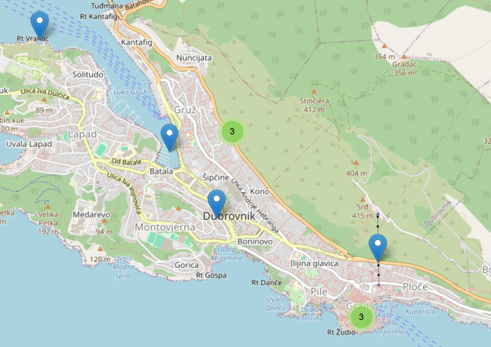

## Turn Raw Transit Data into a Live Knowledge Graph — In Half a Day

What if you could take scattered CSV files, live web APIs, and a global open knowledge and unify them into a rich, queryable, interoperable knowledge graph, **without writing a single line of Java or Python**?

That is exactly what you will do in this tutorial.

Join us for a **hands-on, half-day tutorial** where you will build a real-time **interactive mobility dashboard** from scratch, integrating public transport stops, Wikipedia landmarks, and live data powered by the open-source **Chimera** framework running on top of Apache Camel.

---

## See What You Will Build

By the end of the tutorial, you will have a fully working pipeline that feeds a live map like this one:

*Public transport stops displayed on an interactive map built entirely with declarative data pipelines.*

---

## Why You Should Attend

- **No boilerplate code.** Pipelines are defined in YAML and declarative mapping templates. Configuration, not programming.
- **Real data, real tools.** You will work with actual GTFS feeds (the same format used by Google Maps), live Wikidata SPARQL endpoints, and a Leaflet.js dashboard that updates in real time.
- **Transferable skills.** The any-to-RDF-to-any pattern you learn here applies to any domain smart cities, industry 4.0, health data, and more.
- **From zero to demo.** You will walk away with a working end-to-end system.

---

## What You Will Actually Do

The hands-on session is built around a concrete scenario: **building an integrated mobility dashboard** for transport and tourism stakeholders.

You will configure and run **Apache Camel routes** powered by Chimera components to:

| Step | What happens |
|------|-------------|
| **Ingest** | Read GTFS `.zip` archives containing `stops.txt` CSV files for real bus and metro networks |
| **Lift** | Transform CSV rows into RDF triples using the **Mapping Template Language (MTL)** |
| **Enrich** | Query **Wikidata** via SPARQL to retrieve nearby landmarks with images and descriptions |
| **Construct** | Run SPARQL `CONSTRUCT` queries to build the final knowledge graph |
| **Lower** | Convert RDF back to CSV for the dashboard using a MTL lowering template |
| **Visualise** | Watch stops and landmarks appear live on an interactive **Leaflet** map with marker clustering |

---

## Tutorial Outline

This **half-day tutorial** follows the schedule below:

1. **Challenges of Data Interoperability** *(45 min)*  
   Real-world scenarios, typical failure modes, and why ad-hoc integrations don't scale.

2. **Semantic Data Pipelines with Chimera** *(45 min)*  
   The any-to-one-to-any pattern, RDF as a pivot model, and a tour of the Chimera component library.

3. **Break**

4. **Hands-on Session** *(1 h 30 min)*  
   Guided exercises — configure routes, write mappings, run pipelines, and see your dashboard come to life.

---

## What You Need to Bring

- A laptop with **Docker** installed (all dependencies are containerised — no local JDK or Python needed)
- Basic familiarity with **CSV / JSON** data formats
- Basic familiarity with **RDF** and the Semantic Web stack is recommended

Software instructions and a pre-built Docker image will be published on this page before the tutorial.

---

<!-- ## Abstract -->

<!-- Achieving data interoperability across heterogeneous information systems is a critical challenge in many real-world scenarios. Knowledge graphs offer a powerful foundation for addressing this need, yet implementing such solutions is complex due to diverse data models, evolving requirements, and the prevalence of ad-hoc integrations. -->

<!-- In this tutorial, we first examine the key challenges and typical requirements for enabling interoperability, illustrated through practical scenarios. We then introduce an approach based on **any-to-one mappings to knowledge graphs**, supported by a modular toolbox that enables scalable and low-code integration. Specifically, we present the **Chimera framework**, which provides reusable and configurable components for defining transformation pipelines. Participants will gain hands-on experience by applying this approach to a concrete scenario — configuring and executing Chimera pipelines to achieve interoperability in practice. -->

---

## Speakers

### Marco Grassi  
*Knowledge Technologies Researcher, Cefriel*  
Marco Grassi focuses on semantic technologies and data interoperability. He is the lead developer of the Chimera framework and the main author of the Chimera tutorial available on GitHub.

### Mario Scrocca  
*Senior Knowledge Technologies Researcher, Cefriel*  
Mario Scrocca's research focuses on knowledge representation, data management, and interoperability, with applications in the mobility and industrial domains. He is one of the maintainers of the Chimera framework and has co-organized tutorials on Knowledge Graph Construction, including at ESWC 2022.

### Alessio Carenini  
*Senior Researcher, Technical Leader, and Senior Software Architect, Cefriel*  
Alessio Carenini has over 18 years of experience in European research projects. His work focuses on applying Semantic Web technologies to knowledge management in data sharing ecosystems, with interests in metadata modeling, data spaces, and business process management.

### Irene Celino  
*Research Line Manager, Cefriel*  
Irene Celino coordinates research activities at Cefriel and has over 20 years of experience in cooperative research projects. Her interests include Knowledge Graphs, semantic interoperability, human-in-the-loop and hybrid AI, and human-centric evaluation of AI.

---

## References and Further Reading

**Chimera repository**: <https://github.com/cefriel/chimera>  

**Chimera tutorial repository**: <https://github.com/cefriel/chimera-tutorial>  

**Grassi, M., Scrocca, M., Carenini, A., Comerio, M., Celino, I.**  
Composable semantic data transformation pipelines with Chimera.  
In: *Proceedings of the 4th International Workshop on Knowledge Graph Construction*  
co-located with the 20th Extended Semantic Web Conference.  
CEUR Workshop Proceedings, vol. 3471. CEUR, Hersonissos, Greece (May 2023).  
[PDF](https://ceur-ws.org/Vol-3471/paper9.pdf)  
ISSN: 1613-0073

**Scrocca, M., Carenini, A., Grassi, M., Comerio, M., Celino, I.**  
Not everybody speaks RDF: Knowledge conversion between different data representations.  
In: *Proceedings of the 5th International Workshop on Knowledge Graph Construction*.  
CEUR Workshop Proceedings, vol. 3718. CEUR, Hersonissos, Greece (May 2024).  
[PDF](https://ceur-ws.org/Vol-3718/paper3.pdf)  
ISSN: 1613-0073

**Scrocca, M., Comerio, M., Carenini, A., Celino, I.**  
Turning transport data to comply with EU standards while enabling a multimodal transport knowledge graph.  
In: *Proceedings of the 19th International Semantic Web Conference*.  
Lecture Notes in Computer Science, vol. 12507, pp. 411–429. Springer (2020).  
[DOI](https://doi.org/10.1007/978-3-030-62466-8_26)

---

## Slides and Tutorial Materials

Slides and all required materials will be made available on this page no later than the start of the conference.

- **Slides:** _To be published_  
- **Docker image & setup instructions:** _To be published_  

Please check back closer to the conference date for updates.

---

This work has been partially funded by the European Union's Horizon Europe research and innovation programme under grant agreement No. 101140087 (<a href="https://smarty-chips.eu" target="_blank" rel="noopener noreferrer">SMARTY</a>, Chips Joint Undertaking).

